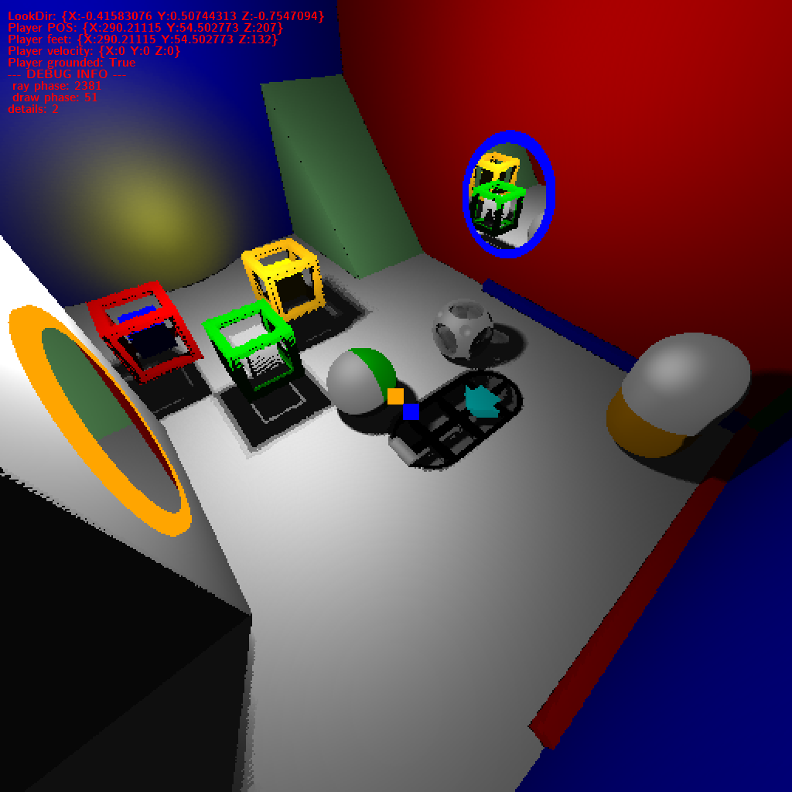
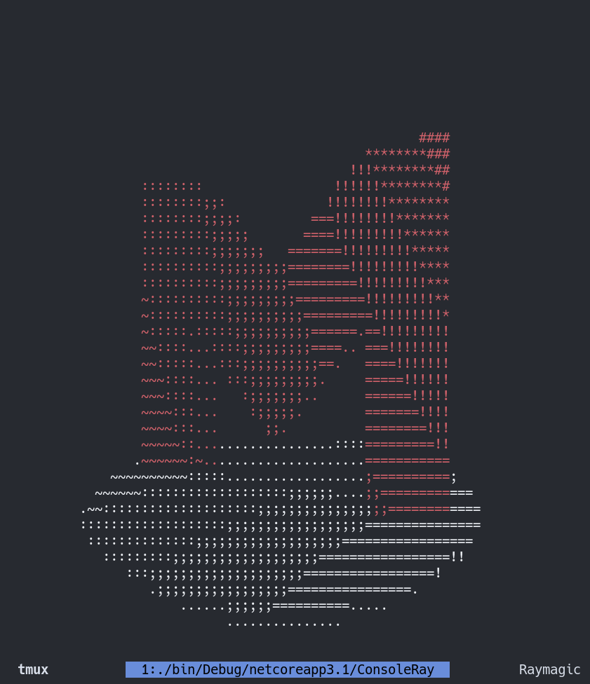

*Marek Bečvář - MFF UK 2021/2022*
# Raymagic

Raymagic began as a small side project in september 2021 to learn about raymarching algorithm.

In the end it grew to the size of this project, much further than anticipated.

The project ended up being a 3D game copying **Portal** and **Portal 2** games built on top of my custom 3D raymarching engine. 

Final version is published as semestral project for subjects NPRG035 and NPRG038 (Programming in C#) at MFF UK.

# ConsoleRay

Small fun weekend side project using the technology I developed for the main program **Raymagic** to be able to draw and light up 3D objects in console with ascii characters.
Finally after many years being able to kind of reproduce this [https://www.youtube.com/watch?v=DEqXNfs_HhY&t=16s&ab_channel=LexFridman](https://youtu.be/DEqXNfs_HhY).

